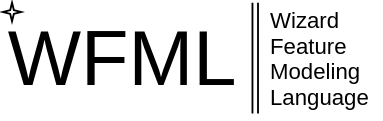

**WFML** (_Wizard Feature Modelling Language_) is a DSL that aims at variability management of dynamic multi-model surrogate optimization.

  [](https://github.com/vprokopets/WFML/actions/workflows/python-app.yml)
## Main implementation moments

#### A basis for grammar 
We decided to use the grammar of the **Clafer** tool as a basis for developed feature modeling language. The reason is that the Clafer is the simplest and one of the most advanced textual variability modeling approaches. Clafer uses grammar formalism Labelled BNF(LBNF), used in the compiler construction tool BNF Converter (BNFC). Clafer itself is implemented in Haskell.


#### Programming language for FML creation. 
Due to Haskell's limitations, we decided to use Python language for language compiler creation. The reason for Python selection is the simplicity and readability of language combined with its expansive possibilities (Python dynamic types and vast metaprogramming possibilities).

#### Using a tool for DSL creation to simplify the task.
WFML is realized with [**textX**](https://github.com/textX/textX) - meta-language for building Domain-Specific languages in Python. The textX is built on top of the Arpeggio PEG parser. From a grammar description, textX constructs a corresponding Arpeggio parser and a meta-model in runtime. The meta-model contains all the information about the language and Python classes inferred from grammar rules. The parser will parse programs/models written in the new language and construct a Python object graph.

However, textX does not use an LBNF grammar formalism to describe languages. Therefore, the grammar of the Clafer language can not be directly used as input for the textX tool.  So, we translated Clafer language grammar from LBNF to the form used in the textX tool.

## Language Overview

#### Core
Core describes lexer, parser, and transpiler to JSON functionality;
#### User Interface 
UI is implemented with the Django framework.


## Installation and launch
WFML could be launched in two modes:

#### Standalone
This will launch django server on ```127.0.0.1:8000```
#### Docker-compose
This option will build a docker container for application and launch Django server on ```127.0.0.1:8000``` through docker-compose bridge networking

For more information about WFML management, please use ```./wfml.sh help```
## Requirements

Docker (version 20.10.8+) - **only for Docker-compose mode**

Docker-compose (version 1.29.2+) - **only for Docker-compose mode**

Python (version 3.7+) with actual pip installed - **only for Standalone mode**

#### Required pip packaged are listed in  and could be installed with:

```python3.7 -m pip install --no-cache-dir -q -r /root/requirements.txt```

## License

